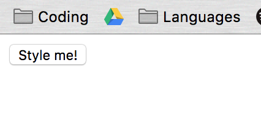
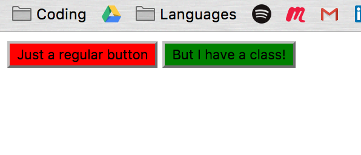
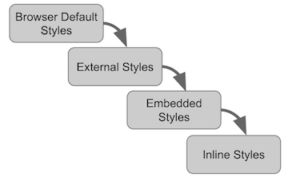
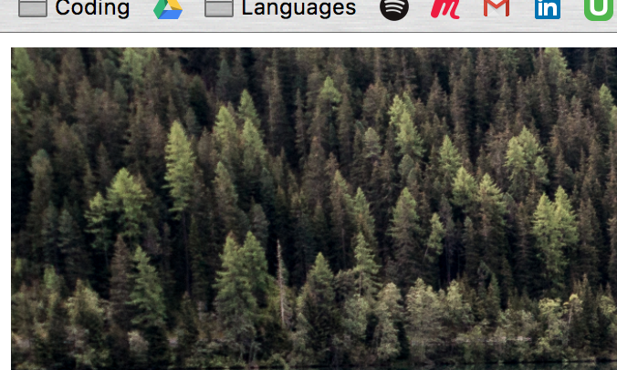
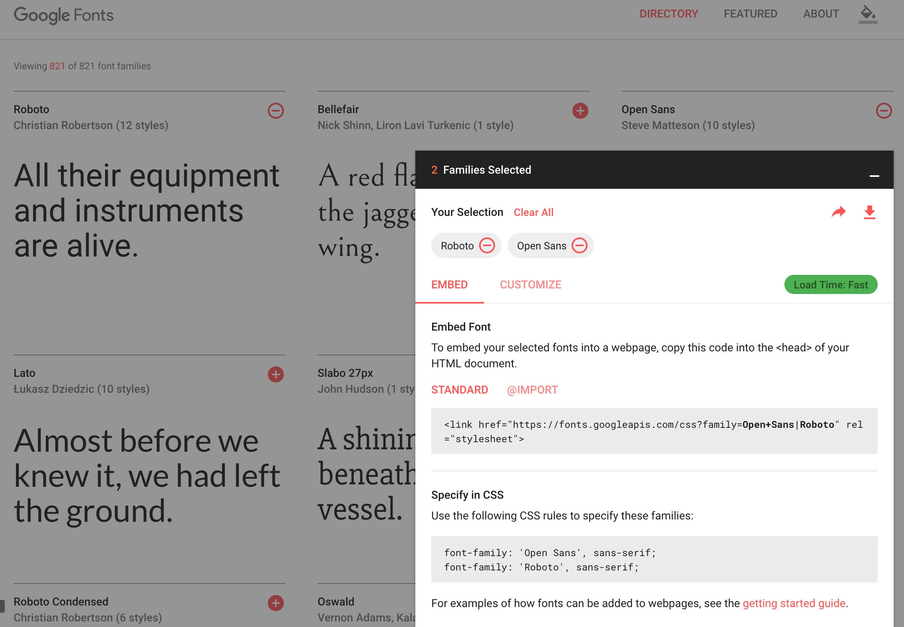
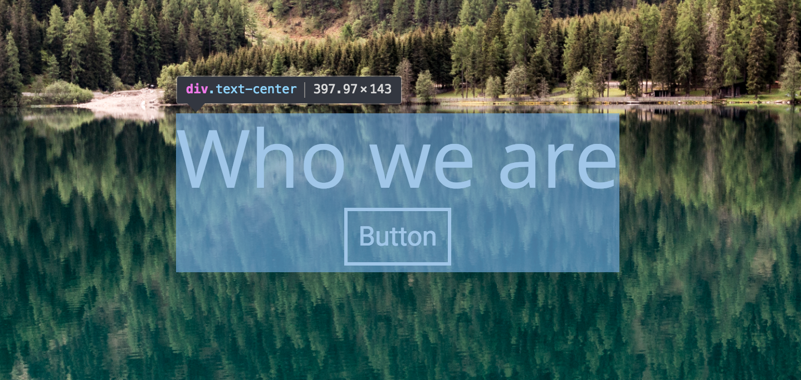

# Contents

- <a href="#one">The 'Cascade'</a>
- <a href="#two">Normalize</a>
- <a href="#three">Selectors</a>
- <a href="#four">Fonts</a>
- <a href="#five">Working with colour</a>
- <a href="#six">CSS hacks : using Chrome's Developer Tools</a>
- <a href="#seven">Links and resources</a>

---


# <span id="one">The Cascade</span>

CSS has a series of simple rules to determine which style rules are loaded when there may be a conflict.

The more _specific_ the rule is, the greater priority the rule will have. Let's look at an example.

Perhaps we have a button:

```html
<button class="css-btn">Style me!</button>
```



We can easily style it by applying a style to all button elements:

`style.css`

```css
button {
  background-color: red;
}
```


What happens if we use the class instead of the element name?

```css
button {
  background-color: red;
}

.css-btn {
  background-color: green;
}
```


The button is now green, even though we're still asserting that all buttons should be red. Because this particular button has a class name, using that class name as a selector is **more specific** than simply using the button element, thus CSS gives this command greater priority.

We can see this if we make two buttons:

```html
<button>Just a regular button</button>
<button class="css-btn">But I have a class!</button>
```



The cascade also applies to where the CSS comes from:



**External stylesheets**

These are CSS files you connect to your page with the `<link>` tag. They can be included in your project directory somewhere, or linked from a host on the web.

**Embedded CSS**

These are styles applied within an individual page via the `<style></style>` tags in the `<head>`.

**Inline CSS**

When we applied the `style="max-width:100%;"` to our `` tag, that was an example of `inline CSS`.

## <span id="two">Normalize</span>

All browsers have default CSS styling. You may have noticed that our image has a white border around it.



This isn't really what we want; for a nice, sharp layout, we want our image sitting flush with the edge of the browser window. To achieve this, we need to remove the default CSS styling in the browser so that we can get a 'clean slate' state for our custom CSS to build on. Enter Normalize.

> Head to [https://necolas.github.io/normalize.css/](https://necolas.github.io/normalize.css/) to download Normalize. Select all of the code in the window and copy it.

We need to put the Normalize styling in a CSS file. Open `Terminal` and, in the root of your project folder, type the following:

```
touch css/normalize.css
```

Then in your IDE, paste the contents of your clipboard into `normalize.css` and save.

Just like we did with our `style.css` file, we'll need to link `normalize.css` in `index.html` for it to have an effect on our site.

To link our normalize file, put this in the `<head>` of `index.html`. **It must go directly above the link for style.css**

```html
<link rel="stylesheet" href="./css/normalize.css">
```

If you refresh your page in the browser, you should now see that there is no margin around our image; the default browser CSS is now removed, and we have a fresh, clean slate to work with.

# <span id="three">Selectors</span>

We've worked with some class selectors already:

```css
.css-btn {
  background-color: green;
}
```

... is an example of a `class selector`; you can tell it refers to a class in the HTML, because it begins with a `.`

If we had given the button an `id` instead of a class, we'd have to use a hashtag:

```css
#css-btn {
  background-color: green;
}
```

This would have the same effect, visually. But unlike classes, ids are meant to be used on **only one** element on the whole page. They're pretty much as specific as you can get when it comes to selecting elements and applying styles, so they should be _used sparingly_; it's much more efficient to make reusable code with classes than to have to write out lots of properties for ids.

Now we're going to open up a `pen` in Codepen, and code along with some selector examples.

> Head to [Codepen](https://codepen.io/) and click on Create > New Pen

---

> ### Exercise

> Complete this game for an excellent grounding in CSS selectors : [CSS Diner!](https://flukeout.github.io/)


# <span id="four">Fonts</span>

Custom fonts can really make your site look crisp and professional, just so long as you limit yourself to 2-3 different font types on your site at most. Remember that if you're pulling fonts in from an external source, it's a HTTP request your site needs to make. Using too many fonts and stylesheets from external sources can slow your site down, so be careful! 

There are plenty of places on the internet to find custom fonts for your project. Let's head to [Google Fonts](https://fonts.google.com/) to select some. 


A common practice is to choose two fonts that work well together; one for your heading and title text, and another for the body text. I'll be using `Roboto` for my headings and `Open Sans` for my body text, but feel free to choose your own.




Like any stylesheet, we need to link to our fonts in the `<head>` of our HTML:

```html
<head>
  <link rel="stylesheet" href="./node_modules/bootstrap/dist/css/bootstrap.min.css">
  <link rel="stylesheet" href="./css/style.css">

  <!-- Google Fonts -->
  <link href="https://fonts.googleapis.com/css?family=Open+Sans|Roboto" rel="stylesheet">

</head>
```


Then, at the very top of our `style.css` sheet, apply them like so:

```css
body {
  font-family: 'Roboto', sans-serif;
  font-size: 14px;
}

h1 {
  font-family: 'Open Sans', sans-serif;
}
```

Refresh your page and you should see your nice new fonts loaded.

# <span id="five">Working with colour</span>

### A helpful tool

[You can download the ColorZilla Chrome extension here.](https://chrome.google.com/webstore/detail/colorzilla/bhlhnicpbhignbdhedgjhgdocnmhomnp/related?hl=en) It will allow you to use a colour picker tool to pluck CSS colour HEX codes straight from any web page you visit.

### Gradients

We're not just limited to flat colours. A recent addition to CSS is the ability to generate gradients. You can specify the direction of the gradient flow, and the colours to fade between, to make really beautiful effects:

```css
selector {
  background: linear-gradient(direction, color-stop1, color-stop2, ...);
}
```

Let's try adding a gradient to the background of our header:

`style.css`:

```css
header {
  height: 35px;
  background: linear-gradient(141deg, #0fb8ad 0%, #1fc8db 51%, #2cb5e8 75%);
}
```


### Transparency

Now that we can use gradients, we're freed from using flat, block colours. But we can take things a step further; the colours you use on your page need not be all opaque. Combining images and transparent colours can create some really interesting effects, and make your page more readable.

```css
.shader {
  position: absolute;
  height: 100%;
  width: 100%;
  background: rgba(0, 0, 0, 0.5);  /* Black color with 50% alpha/opacity */
  z-index: -1;
}
```

This applies a translucent overlay to our hero boxes. But by combining both of the method we've just learned, we can do something _really_ interesting...

```css
.shader {
  position: absolute;
  height: 100%;
  width: 100%;
  background: linear-gradient(0, rgba(0, 0, 0, 1), rgba(0, 0, 0, 0));
  z-index: -1;
}
```

Refresh your page, and you should see a translucent gradient overlay on our `.hero` div. Not only does this simply look slick, it's a great way of darkening an image so that a text overlay is readable.

# <span id="six">Using the DevTools</span>

When we were getting set up with all of the software we'd need for this bootcamp, we decided to use Chrome as our browser. One reason for that is simply that Chrome is very stable, and has good compatibility with current web standards. But the second, and main, reason to use Chrome when developing is that Chrome has excellent advanced tools just for Developers to use when designing and debugging their code.

In any Chrome window, pressing `CMD + Alt + i` will bring up the Developer Tools:


Spend a minute exploring the tools window. You can see a list of all of your HTML elements. To the right, in the Styles pane, you can see every single style which is currently applied to any element you select.

If you click the little arrow in the top-left of the tools toolbar (or press `CMD + Shift + c`), you can turn on the Selector, allowing you to mouse over and select any visual element on your page.



> **NOTE** <br />
> We've made some big changes to our project... you guessed it; it's time to commit them.

> 1. Type `gst` to see our changes.
> 2. `git add .` to add all of our changes to staging.
> 3. `git commit -m "Made header element"` to write the commit message and make the commit.
> 4. `git push` to push our update to GitHub.

# <span id="seven">Links and Resources</span>

  - [How CSS Selectors Work](https://css-tricks.com/how-css-selectors-work/)
  - [Chrome DevTools Overview](https://developer.chrome.com/devtools)


