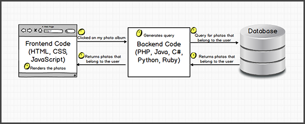

# What is the Front End?

The world of web development is, much like the rest of the Tech world, absolutely full of technical jargon. Listening to professional Web Developers speak can often feel like listening to a foreign language to anyone who doesn't know the lingo. It'd not be any good for us to go charging ahead without first discussing exactly _what it is_ that we're here to study. So let's go ahead and explore what we mean by 'Front End Development'.

## In the beginning, there was HTML...

**HTML** ('Hypertext Markup Language') is the 'building blocks' of the internet. It's a semantic language fordescribing the structure of web pages. First created in 1989, HTML has been around since the beginning of the internet as we know it; while 'the internet' began in 1983, it was only the advent of HTML which gave us the visual medium of the World Wide Web. 

## Getting stylish with CSS

It was a further 7 years before the birth of CSS n 1996. The invention of CSS allows for the seperation of presentation and content, and allows a much easier way of styling an entirely application, including all of it's seperate pages. The CSS specifications are maintained by the World Wide Web Consortium (W3C), and the current specification is CSS3.

## Along came JavaScript

JavaScript was actually 'born' a year before CSS, in 1995. The first iteration was written in just 10 days. JavaScript revolutionized the web by allowing website to have complex behaviour and user interactivity, but the ongoing 'browser war' between Microsoft and Netscape made JavaScript's early days turbulent. Eventually the European Computer Manufacturers Association (ECMA) took on the task of creating a standardized JavaScript, which is why you may sometimes hear JavaScript referred to as 'EcmaScript'or 'ES'. The latest standard of JavaScript is ES6, also referred to as ES2015.

The JavaScript ecosystem is absolutely huge, and frameworks are a big thing right now. You might have heard of things like Angular and React, which are popular JavaScript frameworks maintained by Google and Facebook respectively. While we won't be using any frameworks this week, [this is a good read](https://medium.com/@bojzi/overview-of-the-javascript-ecosystem-8ec4a0b7a7be) if you would like to know more about what's going on in JavaScript today.

## So what's the distinction between the Front End and the Back End?

The 'stack' of web technologies is broadly divided into two categories; Front and Back End. The front end comprises the visual or user-facing side of the application, including the layout, design and interactivity.

The back end could be described as what's going on 'behind the scenes'. It's the archetecture of the app, including the database, the routes, APIs etc.

It's important to note that an app can be purely front or back end. A back end app could be something like a web API, which is a source of data that other apps can make use of.

A purely front end app is also known as a 'static' site, and it's this that we'll be building this week.

### Further study

  - [What front end development means [video]](https://www.youtube.com/watch?v=3VJItso0MsM)
  - [Overview of the JavaScript ecosystem](https://medium.com/@bojzi/overview-of-the-javascript-ecosystem-8ec4a0b7a7be)