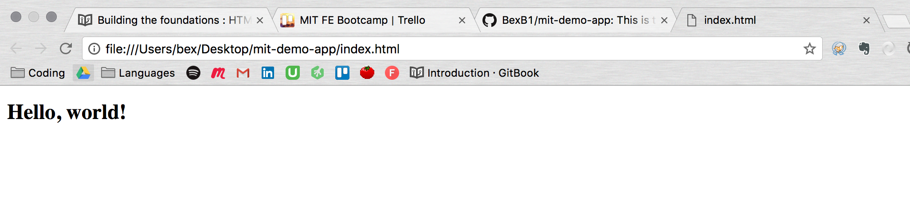

# Contents

- <a href="#one">HTML layout</a>
- <a href="#two">Hello, world!</a>
- <a href="#three">Using comments</a>
- <a href="#four">Fleshing out our page</a>
- <a href="#five">Keeping things DRY with partials</a>

---

# Let's get coding

You've got all of your developer tools set up, and you're ready to start coding. As a front end developer, typically the first place you'll begin is with the 'bare bones' of your project; the HTML page structure.

In the Terminal, while within the folder containing your `index.html`, type `subl .` to open your project with Sublime Text.

# <span id="one">1. HTML layout</span>

HTML files are typically laid out as such:

```html
  <!DOCTYPE html>
  <html>
    <head>
      // content in the head goes here. This usually involves things like CSS / JavaScript links,
      // the title of the page, etc.
    </head>
    <body>
      // Body content goes here.
    </body>
  </html>
```

Let's go through these one-by-one.

  - `<!DOCTYPE html>` tells the browser what type of code to expect.
  - The `<html></html>` tags enclose all of the HTML on our page, and tell the browser where to start and stop reading the code.
  - The `<head>` tags contain all of the HTML code which doesn't make up the body of the web page. Commonly found within the head tags are things like stylesheet links and 'metadata', such as the title of the page which shows up n the browser tab.
  - The`<body>` tags contain the meat of the page; here's where we'll declare all of the components making up the visual structure of the page.

# <span id="two">2. Hello, world!</span>

Now to get something showing up in our browser. Right-click `index.html` in the Sublime sidebar and select 'Open in Browser > Chrome'. It should just be a blank screen.

If we enter the following...

```html
<h1>Hello, world!</h1>
```

We should see this:



So we know that our HTML is showing up on our page just fine.

Let's put our first image in. Remove the previous `<h1>` tag and enter between the body tags:

```html

```

Note that the `` tag is _self-closing_-- you don't need an accompanying `</img>` tag to tell the browser where the image ends, unlike in the heading tag we just used.

If you refresh `index.html` in your browser, you should see the image showing up. But it's pretty huge, so we'll need to resize it. We could do something like the following:

```html

```

This at least makes the image fully visible, but it's not a great solution; ideally, we want the image to take up the whole screen. The trouble is, we don't know how big the user's screen is. For this, we'll need some CSS. We don't have any stylesheets made just yet, so we'll use some `inline CSS`:

```html

```

Inline CSS is when you attach the CSS styling directly to the tag of the HTML element it affects. Shortly we'll make some style sheets and move all of our styling into there, but for now this is a temporary solution to our image sizing problem.

# <span id="three">4. Using comments</span>

Comments are a great way to kind of 'signpost' your code. Think of them as sticky notes you might put on a book. When you 'comment out' some code, it won't affect the resulting browser code at all. So you can use code either to make code 'latent', or for your own notation purposes.

To remind ourselves to remove the inline CSS when we made our stylesheets, let's make a comment about our `img` tag now.


# <span id="four">5. Fleshing out our page</span>

It's time to get some text into our app.

Add a `div` element beneath our image. `div` stands for 'division', but it's better to think of a div as a box. It's a container for whatever other HTML elements you want to put in that box, which you can then manipulate with CSS to get it to behave however you want. Within the div, open some paragraph tags; `<p`>, like so:

```html
<!doctype html>
<html>
  <head>

  </head>
  <body>

    <!-- NOTE : remove the inline CSS when stylesheets are made! -->
    

    <div>
      <p>
        Lorem ipsum dolor sit amet, consectetur adipisicing elit. Itaque cumque amet provident eligendi ut id, ratione quasi tenetur ipsum repellendus aperiam voluptatum eaque reiciendis, eos quae tempora temporibus magni hic?
      </p>      

      <p>
        Lorem ipsum dolor sit amet, consectetur adipisicing elit. Itaque cumque amet provident eligendi ut id, ratione quasi tenetur ipsum repellendus aperiam voluptatum eaque reiciendis, eos quae tempora temporibus magni hic?
      </p>
    </div>

  </body>
</html>
```

**Note:** you can type `lorem` and then press tab to instantly get some filler text, but if you'd like some alternative ipsum text you can check out [Choose Your Ipsum](http://idsgn.dropmark.com/107). Two of my favourites are [Hipster Ipsum](https://hipsum.co/) and [Cat Ipsum](http://www.catipsum.com/).

> If you're using Sublime Text and you want a bit more text, highlight the lines you want to duplicate (the `<p>` tags and the text within) and press `CMD + Shift + D`.


### Making a header and footer

### Making and linking to additional pages


# <span id="five">6. Keeping things DRY with partials</span>

Typically a header will be displayed constantly across all pages on a single site. Trouble is, if we want that to be the case here, we'll have to copy and paste the header code into all pages of our site. Not only is that kind of a pain, it's also bad coding practice.

[The 'DRY' Principle](https://en.wikipedia.org/wiki/Don%27t_repeat_yourself) states that we should do something to reduce unnecessary code repetition. Ideally what we'd like to do here is write the code for the header once and have it generate on every page. We're going to do that with something known as a `template engine`. We'll be using Handlebars.js.


> [Download Handlebars here](http://handlebarsjs.com/installation.html)