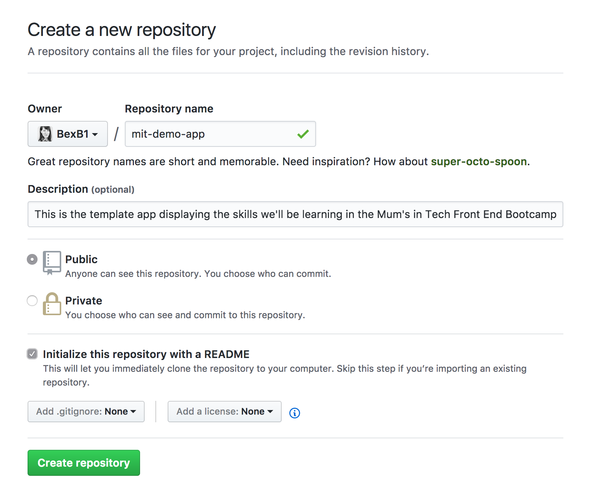
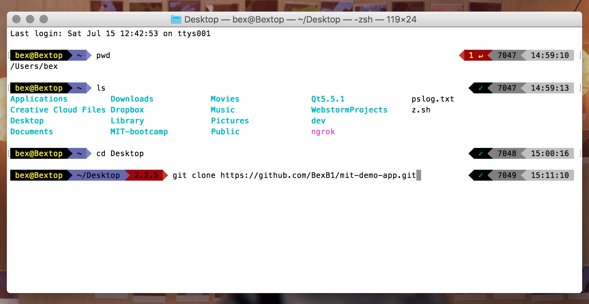

# Contents

- <a href="#one">What is the Terminal?</a>
- <a href="#two">Git : What and why?</a>
- <a href="#three">Walkthrough</a>
- <a href="#four">Commands cheat sheet</a>

---

Now that we've got everything installed, let's go ahead and get started with the foundations of our project.

# What is the Terminal?

You can think of the Terminal as the brain of your computer. It's the inner workings of your computer at the very lowest level, without the visual user interface presented when you explore your files and folders using Finder or Explorer. Using Terminal can be a bit bewildering at first, but once you get the hang of it, it's a much faster and simpler way of working with files.

# Git : What and why?

Git is the _Command Line Interface (CLI)_ component of GitHub. GitHub basically allows us to host our projects (called _repositories_) in the virtual cloud, and even host our projects there as website for people around the world to view.

Think of writing a letter on your computer; you regularly save the file you're working on in Microsoft Word to protect it in case you make a mistake or something goes wrong with your computer. If you want to go back to a previous version of your file, you can just use the 'undo' button.

Git allows us to do this, but with a whole folder of files all at once. You can create save points (called _'commits'_), to which you can return at any point if things go wrong. Not only that, but Git allows several people to work on a project at the same time without stumbling all over each other's changes to the folder, via _'branches'_.

### So why are we using Git and GitHub for this bootcamp?

Put simply, for two main reasons:

  - It will allow us to work in a fast and safe manner, where mistakes aren't a major problem and can be easily undone.
  - It will allow us to very easily get what we make up on the internet at the end of the week, for the world to see.

---

# Walkthrough

**1.** To begin, we'll need to head to github.com and make a new repository. Click the `+` sign in the header menu, and select `New repository`.

---

Call your repository whatever you want, and add a description if you want to. Make sure you tick the radio button for making the repo public, and check the `'Initialize this repository with a README'` box down the bottom. Then click the `'Create repository' button.

---

Next, we need to `clone` this folder from the internet onto our computer. After you created your repository just it, GitHub would have placed you on the homepage for your repo. Click the green 'Clone or download' button and copy the `HTTPS` URL in the input box.

Now we're going to use our first `terminal` command.

---

**2.** Open `terminal`, and navigate to where you want your project files to be located. A good choice is the Desktop, so that your files will be easily visible.

If you're not sure which folder you're currently looking at in the Terminal, you can type `pwd` (print working directory).

To move around on your computer, you'll need to use the `cd` command (change directory). If you want to see what's in the folder you're currently in, you can type `ls` to list the files in there.

Once you're in the location where you want to copy your project folder to, enter `git clone URL_HERE` - replacing the `URL_HERE` with the URL you copied from GitHub.

---

**3.** GitHub will clone the repo onto your computer. If you type `ls` into the Terminal now, you'll see your new repo folder in your location. Use `cd` to go into it. If you use `ls` inside of this new folder, you'll see that it's empty except for the `README.md` file. But there are a few extra things going on here; because we cloned the folder down from GitHub, this folder is automatically linked to it's copy in the cloud, on GitHub. This means that we can easily `push` (upload) and `pull` (download) files between our computer and the cloud.

---

**4.** We're going to do two more things before we start coding;

  1. Make our first file using the Terminal, and
  2. Make our first commit.

In the Terminal, type `touch index.html` and press enter. Now type `ls`, and you'll see your newly-created file within the folder. Hopefully you're beginning to see how using the Terminal can be much faster than moving around in Finder/Explorer and right-clicking to do everything!

But there's something else interesting that just happened. Type `gst` into your Terminal - this is short for 'Git status', and will tell you what's going on with Git now. You should see something like this:

Git has spotted that you've made changes to your folder! It can see that you've made a new file, and it's telling you that this makes your copy of the repo different to the one present on GitHub. In order to match them up again, do the following:

> 1. Type `git add .` (add all folder contents to Git tracking). Type `gst` to see what's going on.
> 2. Type `git commit -m 'First commit'` (This commits the current state of the repo to a save point, with a message). Then `gst`.
> 3. Type `git push` (this uploads the current save state of our repo to GitHub) Now `gst` once more.

This updates the online version of our repo with our local version, which means that the changes we've made are now safely saved and stored in the cloud. 

Now we're ready to start coding!

---

# Commands cheat sheet

- `pwd` - print working directory (where am I right now?)
- `cd`- change directory (move me elsewhere).
- `ls`- list items in this folder (directory).
- `touch FILE_NAME` - make a file

** Git commands**

- `gst / git status` - show me what's going on with Git.
- `git add .` - add the contents of this folder to Git tracking
- `git commit -m "MESSAGE_HERE"` - 'save' the currently tracked files and add a message
- `git push` - upload this save point to GitHub.
- `git clone URL_HERE`- clone a GitHub repo down onto your computer.

