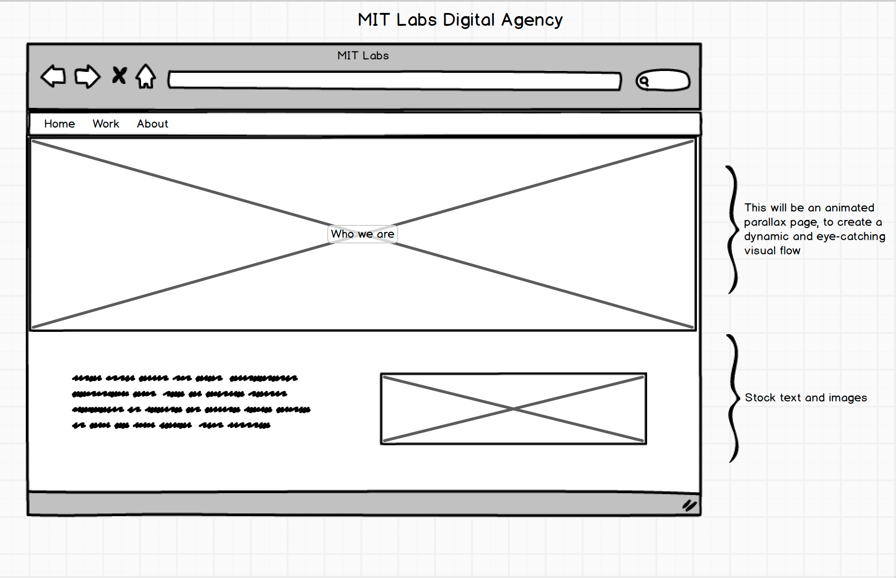

# What we'll be building

---

The app we build this week will:

  - Be a static web page built in HTML, CSS (Sass) and JavaScript.
  - Utilise several packages and libraries to allow us to add greater complexity. These include:
    - A CSS extension, Sass.
    - Bootstrap, a popular CSS framework.
    - jQuery, a popular JavaScript library. 
    - Handlebars.js, a popular JavaScript templating engine.
  - Alongside these, we'll be using some advanced developer tools:
    - Gulp for Sass compilation and live reloading

## The design

Making wireframe of your project is often the best place to begin your development process.

These wireframes were made in [Balsamiq Mockups](https://balsamiq.com/)

