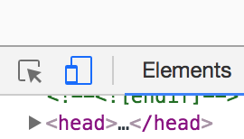
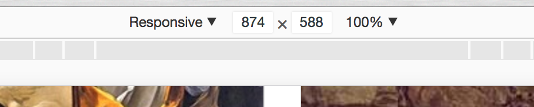

# Contents

- <a href="#one">Why be responsive?</a>
- <a href="#one">Using media queries</a>
- <a href="#one">Responsive testing using Chrome Dev Tools</a>
- <a href="#one">Making our header responsive</a>

---

# <span id="one">Why be responsive?</span>

It used to be the case that, not matter how you wanted to style your page, you didn't have to worry too much about the user experience differing between users. Browser formatting variations aside, most people saw roughly the same site because there was only one device you could view the internet on; a computer monitor.

But these days we live in the 'Internet of Things'; an ever-growing selection of vastly different types of devices are hooked up to the web at all times. This means plenty of different screens; not only desktop monitors, but also laptop screens, notebooks, and tablets and smartphones of all different shapes and sizes.

When responsive design first began to become an ever-bigger problem, web developers responded by making two versions of a site; the 'full size' one for the most common desktop screensizes, and a version for mobile devices, often under a subdomain.

Responsive design means that no matter the size or shape of the screen being used to display content, that content can be reliably viewed and interacted with. Responsive design is now a web standard; it's not optional. Failing to build your front end with responsiveness in mind can not only make your site unattractive for your users - it can make it outright unusable.

# <span id="two">Responsive measurements</span>

CSS has a number of ways of defining the sizes of elements. We've already seen `px` and `%`.

`px` stands for pixels, and while still commonly used by developers, isn't the best units to choose for making an optimally-responsive layout.

Another two units of measurement in CSS are `vh` and `vw`, which stands for `viewport height` and `viewport width` respectively. `1vh` is sized to 1% of the viewport's (the screen's) height, making these great units for building a responsive site.

# <span id="two">Using media queries</span>

Media queries are methods in CSS which tell the browser to _intelligently change the layout and display of a page based on the screen width._ This means that the visual appearance of a site will not only differ for individual users viewing on different devices, but also that what the user sees can change _dynamically, in real time_.

To see this in action, [head to Unbound.com](https://www.unbound.com/books/), select any book to view and open the DevTools.

On the DevTools toolbar, there is an icon for viewing the current site as if you were on a different device:



Clicking this will bring up the `device toolbar`. Here you can choose to view the page either at a set width, or with a fluid display.



By clicking and dragging the right-hand slider, you can change the width of the viewport. See how the layout changes when you get to certain widths? This is the result of `breakpoints`.

Media queries look like this:

```css
@media screen and (min-width: 900px) {
    body {
        background: red;
    }
}
```

This code says, "If the viewport width is 900px or over, make the background red."

> **Exercise**

> 1. [Open up repl.it](https://repl.it/) and in the dropdown box, select HTML, CSS and JS.

> Put nothing in the HTML, but put media queries in the CSS panel that will change the background like so:

>- Make it red at 900px width and above.
>- Make it orange between 600px and 900px width.
>- Keep going so that when you narrow the screen width, you cycle through the rainbow!

# Useful links

- [Liquidapsive - see the different kinds of responsiveness](http://www.liquidapsive.com/)
- [caniuse.com](http://caniuse.com/)
- [css-tricks](https://css-tricks.com/)
- [css reference](http://cssreference.io/)


