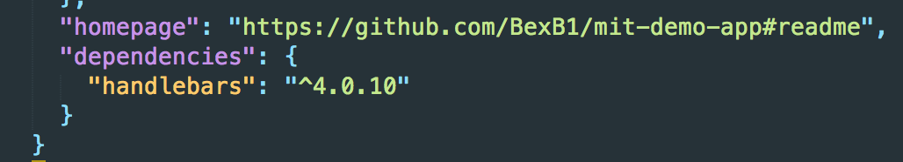

# <span id="five">6. Keeping things DRY with partials</span>

Typically a header will be displayed constantly across all pages on a single site. Trouble is, if we want that to be the case here, we'll have to copy and paste the header code into all pages of our site. Not only is that kind of a pain, it's also bad coding practice.

[The 'DRY' Principle](https://en.wikipedia.org/wiki/Don%27t_repeat_yourself) states that we should do something to reduce unnecessary code repetition. Ideally what we'd like to do here is write the code for the header once and have it generate on every page. We're going to do that with something known as a `templating engine`. We'll be using Handlebars.js.


In order to use Handlebars in our project, we're going to install it with **npm**.

# Installing a package with npm

In `Terminal`:

```
npm install --save handlebars
```

This command instructs `npm` to go to the internet and install Handlebars from among the thousands of available JavaScript packages that other developers have written and uploaded for others to use.

The `--save` option instructs `npm` to save the Handlebars version in our `package.json` file. If you look there now, you'll see it:



This means that anyone else who clones your project and runs `npm install` in the Terminal, will get the exact version of Handlebars that you're using.

## Creating a header partial

We're going to change our folder structure a bit now, because partials should be kept together in their own folder.

In `Terminal`, and the project root:

```
mkdir partials
touch partials/_header.html
```

The naming convention for partials is to prefix them with an underscore.